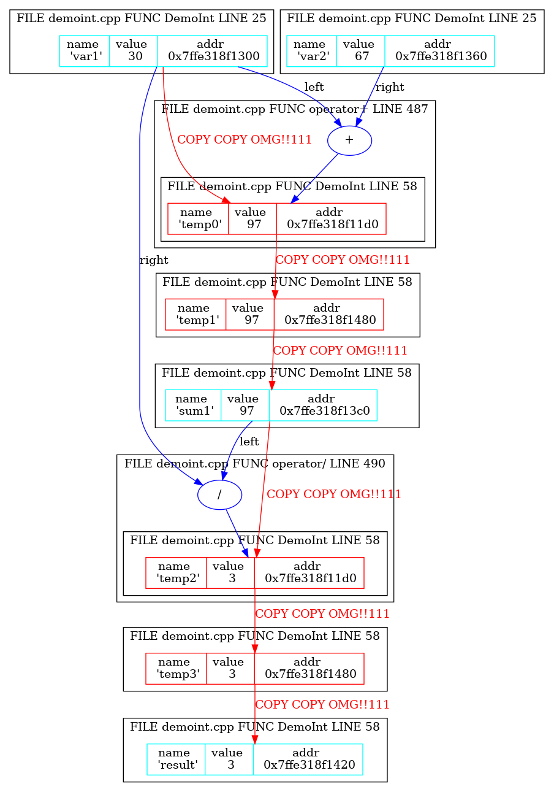
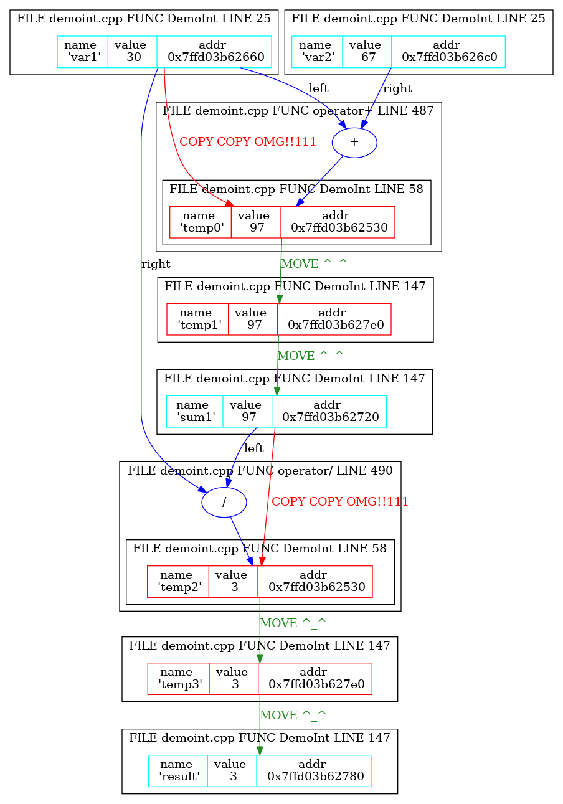
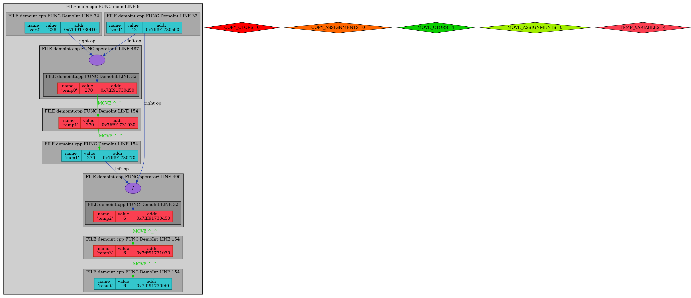
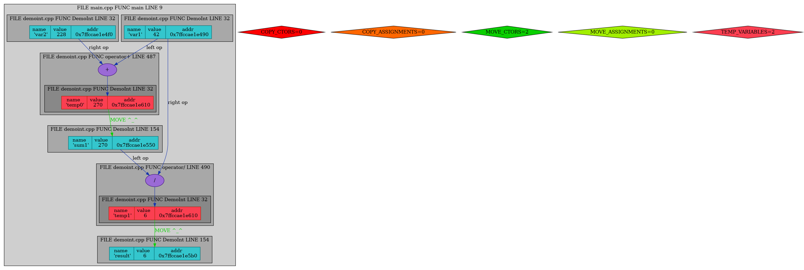

# DemoInt (Tracked copy/move semantics)

This repository is devoted to the topic of copy/move semantics.

***
## Brief introduction
C++11 provided us plenty of new things, and in this whole bunch such novelties
as __rvalue references__ and __move semantics__ can be noticed. Although it may seem
that these entities are peculiarly similar to lvalue references and copy semantics accordingly,
they introduce some new ideas in C++.

***
## Rvalue references
The main purpose of rvalue references (they are marked like
*&&* - two ampersands) is to deal with temporary objects 
(which are to be destroyed soon).

***
## Copy semantics reminder
Copying in C++ divides into two types: __shallow copying__ and __deep copying__.

### Shallow copying
Shallow copying is copying the "first level" of data without going further. It means that
in case of copying, for example, an object of a class only its fields will be cloned, nothing more.
It is faster, than the second variant, but can lead to the "ownership problem", when there is some 
data belonging to a specific object and after the described action it becomes a trouble to determine 
its owner. A nice example is a class containing a pointer to an array with data; shallow copying will
copy only the pointers, not the whole information, so we have natural trouble: who should delete the array?
This way of copying is used by default by compiler.

### Deep copying
Unlike shallow copying, deep copying clones the whole information. As a result, the copy is "independent",
but such actions demand more resources such as memory and time to be completed. Briefly speaking, it is 
slow and expensive, but reliable solution. In the case of array described above the copy will receive its
own array with cloned data, so problems connected with ownership just do not appear.

#### Here is the illustration:

***
## Constructors and assignment operators
Since there are copy and move constructors now there are four ways to use one of the whole bunch of their variations:
1) `T(T &)` -- *non-const copy constructor*; it is slow and even dangerous, as it is possible to corrupt
the transmitted object because the reference is non-const. Not a good choice.
2) `T(const T &)` -- *const copy constructor*; correct form of copy constructor. It is also slow as the
previous variant, but at least cannot change the transmitted object.
3) `T(T &&)` -- *non-const move constructor*; correct form of move constructor. Rvalue is temporary object,
so we often want to change it, "throwing out" unnecessary data. As it is move constructor, it is a
better choice for speed comparing to the copy constructor.
4) `T(const T &&)` -- *const move constructor*; as the transmitted object is const, we cannot change it.
This obliges us to do deep copying, so this type of move constructor loses its sense.

Situation is quite similar with assignment operators.

***
## Investigation
Only 2) and 3) points from the previous list will be investigated; other two are used seldom or (more likely) 
not used at all. The program is in `main.cpp` and is quite simple. It creates two variables, sums them and puts 
the result to the third variable; then it gets divided by the first variable and result is put to the fourth variable. 
Our goal is to decrease the number of copy operations by changing them to move operations as we consider that 
each copy operation takes __significantly__ more time comparing with move operation and is just too long. 
It should be mentioned that the program was compiled with `-fno-elide-constructors` 
flag to prevent automatic optimizations (except the last stage).

### Stage 1: program allows copying `DemoInt` variables but not moving them, `-fno-elide-constructors` is disabled
As it is mentioned in the header, there is no move semantics in this case, so the situation is 
quite disappointing: graph is full of unnecessary temporary variables and copy constructor calls.
tell us program is 
really slow and uneffective (__six__ copy operations and __four__ temporary variables!): 

### Stage 2: program allows copying and moving `DemoInt` variables, `-fno-elide-constructors` is disabled
Now move constructors are enabled, and therefore the whole picture looks better. However,
we still have __two__ copy operations and __four__ temporary variables (but now there are __four__ moves):

### Stage 3: replacement of some inefficient code noticed
Soon after move constructors were enabled, a little inefficiency was noticed in the code 
inside `BINARY_OP_DEMOINT` define.
`DemoInt this_copy = *this; this_copy op_symb##= other;` was changed to `DemoInt this_copy(this->value_ op_symb other.value_)`.
The result is __zero__ copies, __four__ moves, but still __four__ temporary variables:

### Stage 4: compiler's copy elision
Now we allow compiler to optimize our program. This gives us a significant boost in efficiency,
because we omit __two__ temporary variables, leaving __two__ more and __two__ move operations:

## Conclusion
All in all, a part of copy constructors might be changed to move constructors. Move semantics
provides faster operations via shallow copying, but lacks safety. In its turn, copy semantics
gives us certainty that nothing will be corrupted, but it is really slow.
