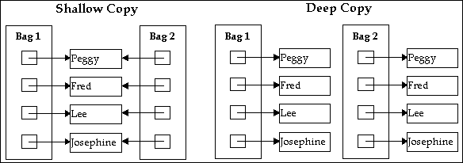
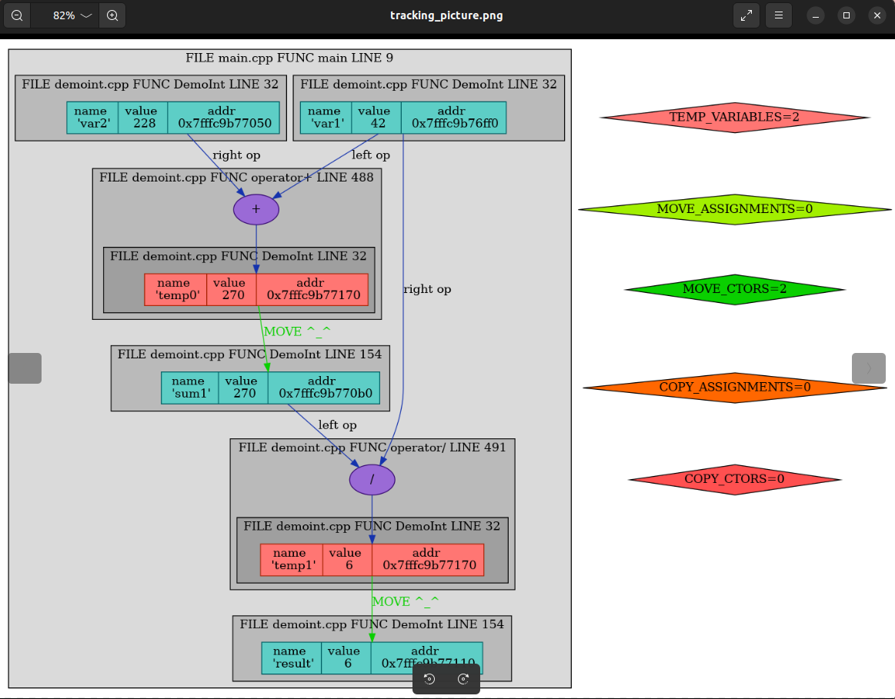

# DemoInt (Tracked copy/move semantics)
This repository is devoted to the topic of copy/move semantics.

***
## Brief introduction
C++11 introduced plenty of new things to us, and in this whole bunch of novelties such examples
as __rvalue references__ and __move semantics__ can be noticed. Although it may seem
that these entities are peculiarly similar to lvalue references and copy semantics
accordingly, they introduce some new ideas to the language.

***
## Rvalue references
The main purpose of rvalue references (they are marked like *&&* - two ampersands) 
is to operate with temporary objects (which are to be destroyed soon).

***
## Copy semantics reminder
Copying in C++ divides into two types: __shallow copying__ and __deep copying__.

### Shallow copying
Shallow copying copies the "first level" of data without going further. It means that
in case of copying, for example, an object of a class only its fields will be cloned, nothing more.
Therefore, if the object contains _some data_ that can be shared with other objects (a nice example is
a pointer to allocated memory), a new object copied from existing will receive an access to exactly
_this data_, not to its copied version. As a consequence, any changes to _the data_ work in both
directions, effect may be seen in both objects. Roughly speaking, the new object is idiomatically a
reference to the old one.

### Deep copying
Unlike shallow copying, deep copying clones the whole information, making a new object that is
fully separated from the previous one. In this case any changes to one of these objects will not
influence the other: both of them are autonomic.

#### Here is the illustration:

***
## Move semantics
Now it is time to say a couple of words about move semantics.

Move semantics is a new feature introduced in C++11 as an alternative to copy semantics. Obviously,
it is not supposed to replace the last one; however, it provides an opportunity to compensate 
ineffectiveness of copying in some cases (caused by time and memory resources spent on copying).

Move constructor is a constructor that takes an rvalue reference as an argument. It creates an object
via the resources of the existing one, but instead of copying it just takes ownership of them. As a result,
data starts to belong to the new object while the old one is usually left empty. 

TO SECTION OF DIFFERENCES
As a result, the copy is "independent",
but such actions demand more resources such as memory and time to be completed. Briefly speaking, it is 
slow and expensive, but reliable solution. 

TO SECTION OF SITIUATIONS
In the case of array described above the copy will receive its
own array with cloned data, so problems connected with ownership just do not appear.

***
## Constructors and assignment operators
Below syntactic expressions 
1) `T(T &)` -- _non-const copy constructor_; it is considered to be slow (because of copying contents
from argument object to a new object) and even dangerous, as it is possible to corrupt the transmitted
object since the reference to it is non-const (the author of the readme file assumes it is common to
__not__ to change the object being copied from). Not a good choice.
2) `T(const T &)` -- _const copy constructor_; correct form of copy constructor. It is also slow as the
previous variant (the reasons are the same), but at least cannot change the transmitted object (because
the reference to it is const).
3) `T(T &&)` -- _non-const move constructor_; correct form of move constructor. Rvalue is temporary object,
so we usually want to change it, "throwing out" unnecessary data and obtaining it from the given object.
As it is a move constructor, it is a better choice for program rapidity comparing to the copy constructor
as it does not spend time and resources on copying. However, it "steals" data from its argument which can cause
troubles: e.g. `free` of some allocated memory in given object's destructor can lead to "double free problem" if
the pointer to this memory was not assigned to `nullptr` timely.
4) `T(const T &&)` -- _const move constructor_; as the transmitted object is const, we cannot change it.
This obliges us to do deep copying, so this type of move constructor does not do what he is destined to.

### Small summary
|               | Safety (of an argument)         | Rapidity (slow if requires copying, fast if does moving) |    Expediency (in a production code)       |
| :------------ | :-----------------------------: | :------------------------------------------------------: | :----------------------------------------: |
| T(T &)        |        Non-safe                 |                          Slow                            | Too dangerous; used rarely, almost never   |
| T(const T &)  |          Safe                   |                          Slow                            | Does not corrupt the argument, widely used |
| T(T &&)       | Non-safe (but that is assumed!) |                          Fast                            | Allows rapidly "stealing" data from expiring object, widely used |
| T(const T &&) | Safe (but that is an absurd!) |                     Fast                            | Saves argument from corruption, but that is nonsense since we cannot extract the data from it rapidly, it forces us to copy and therefore becomes useless.

The situation is almost similar with assignment operators:
1) `T &operator =(T &)`
2) `T &operator =(const T &)`
3) `T &operator =(T &&)`
4) `T &operator =(const T &&)`

***
## Investigation
Only 2) and 3) points from the previous list will be investigated; other two are used seldom or (more likely) 
not used at all. The program is in `main.cpp` and is quite simple. It creates two variables, sums them and puts 
the result to the third variable; then it gets divided by the first variable and result is put to the fourth variable.

Our goal is to decrease the number of copy operations by changing them to move operations as we consider that 
each copy operation takes __significantly__ more time comparing with move operation, is just too long and demands
additional memory.
It should be mentioned that the program was compiled with `-fno-elide-constructors` 
flag to prevent automatic optimizations (except the last stage).

### Stage 1: program allows copying `DemoInt` variables but not moving them, `-fno-elide-constructors` is disabled
As it is mentioned in the header, there is no move semantics in this case, so the situation is 
quite disappointing: graph is full of unnecessary temporary variables and copy constructor calls.
tell us program is 
really slow and uneffective (__six__ copy operations and __four__ temporary variables!): 

### Stage 2: program allows copying and moving `DemoInt` variables, `-fno-elide-constructors` is disabled
Now move constructors are enabled, and therefore the whole picture looks better. However,
we still have __two__ copy operations and __four__ temporary variables (but now there are __four__ moves):

### Stage 3: replacement of some inefficient code provided
Soon after move constructors were enabled, a little inefficiency was noticed in the code 
inside `BINARY_OP_DEMOINT` define.
`DemoInt this_copy = *this; this_copy op_symb##= other;` was changed to `DemoInt this_copy(this->value_ op_symb other.value_)`.
The result is __zero__ copies, __four__ moves, but still __four__ temporary variables:

### Stage 4: compiler's copy elision
Now we allow compiler to optimize our program. This gives us a significant boost in efficiency,
because we omit __two__ temporary variables, leaving __two__ more and __two__ move operations:

## Conclusion
All in all, a part of copy constructors might be changed to move constructors. Move semantics
provides faster operations via shallow copying, but lacks safety. In its turn, copy semantics
gives us certainty that nothing will be corrupted, but it is really slow.
